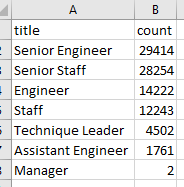

# Pewlett-Hackard-Analysis
## Overview of the Analysis
Bobby has been tasked to look into the number of employees retiring at Pewlett Hackard to help the company prepare to backfill these roles. After looking at the number of retirees, he is also asked to look at the number of employees that are eligible for a mentorship program to prepare them for future positions.
## Results

## Summary
